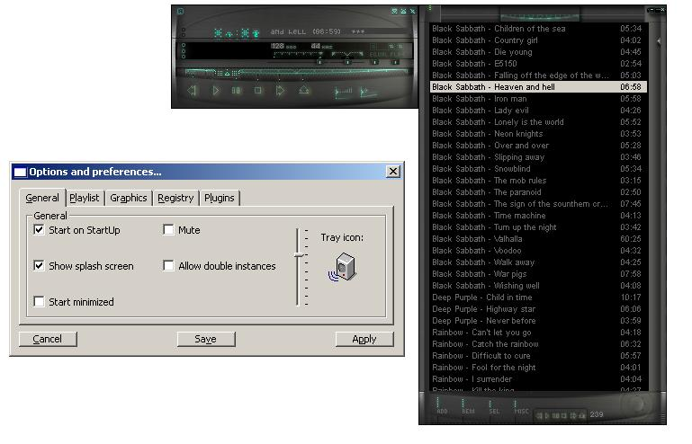



## CoolPlayer \(the ultimate Winamp clone improved\) 100% Update\.\.\.more features and functions\.\.\.

### Description

Here we go: Uses Winamp's skins, plugin with source, always on top, shuffle, loop, change tray icon, transparency level, splash screen, start on Windows load, double instances, snap windows, sorting, file associations, text search, jump to time,ini hadnle , ID3v1 and MPEG info and many more... Enjoy it and leave comments!!!
 
### More Info
 

             |
---                |---
**Submitted On**   |2003-01-15 18:39:28
**By**             |[Giannis\_B](https://github.com/Planet-Source-Code/PSCIndex/blob/master/ByAuthor/giannis-b.md)
**Level**          |Intermediate
**User Rating**    |4.7 (141 globes from 30 users)
**Compatibility**  |VB 6\.0
**Category**       |[Sound/MP3](https://github.com/Planet-Source-Code/PSCIndex/blob/master/ByCategory/sound-mp3__1-45.md)
**World**          |[Visual Basic](https://github.com/Planet-Source-Code/PSCIndex/blob/master/ByWorld/visual-basic.md)
**Archive File**   |[CoolPlayer1530061162003\.zip](https://github.com/Planet-Source-Code/giannis-b-coolplayer-the-ultimate-winamp-clone-improved-100-update-more-features-and-funct__1-42111/archive/master.zip)

